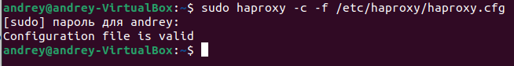
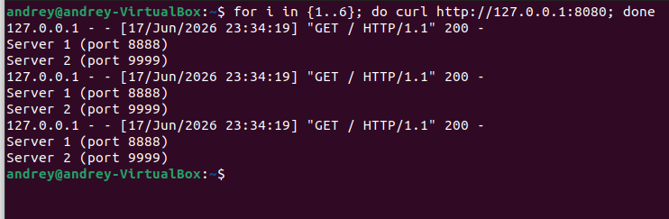

# Домашнее задание: Балансировка HAProxy + Nginx

**Студент:** Калинин Андрей  

---

Проверка работоспособности
Скриншот 1 – проверка синтаксиса HAProxy


Скриншот 2 – чередование запросов
Выполнено несколько запросов к HAProxy, ответы приходят по очереди от первого и второго серверов.



## Задание 1. Балансировка Round-robin на 4 уровне (TCP)

### Описание
Запущено два Python-сервера на портах 8888 и 9999.  
HAProxy настроен в режиме TCP (L4) с алгоритмом roundrobin и слушает порт 8080.

### Конфигурация HAProxy (задание 1)

```haproxy
global
    log /dev/log local0
    log /dev/log local1 notice
    chroot /var/lib/haproxy
    stats socket /run/haproxy/admin.sock mode 660 level admin expose-fd listeners
    stats timeout 30s
    user haproxy
    group haproxy
    daemon

defaults
    log global
    mode tcp
    option tcplog
    timeout connect 5000
    timeout client 50000
    timeout server 50000

listen web_balancer
    bind :8080
    mode tcp
    balance roundrobin
    server s1 127.0.0.1:8888 check
    server s2 127.0.0.1:9999 check

listen stats
    bind :8081
    mode http
    stats enable
    stats uri /stats
    stats refresh 5s
    stats auth admin:admin


