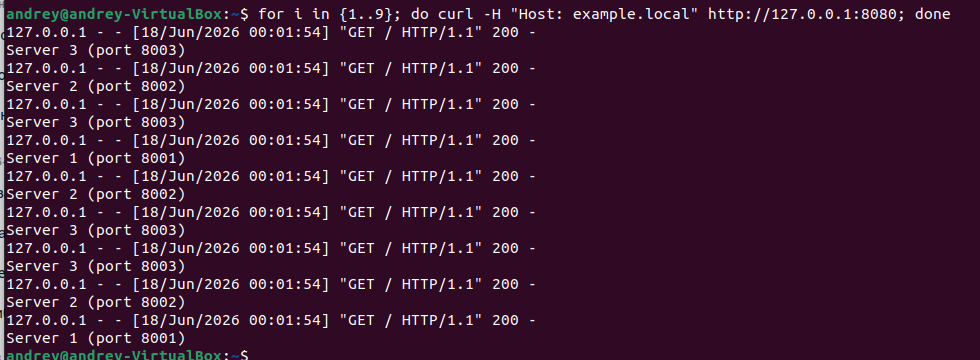
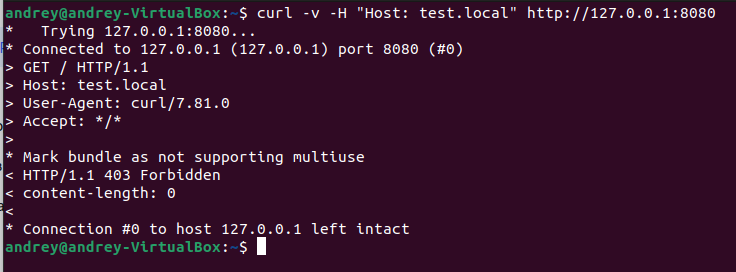
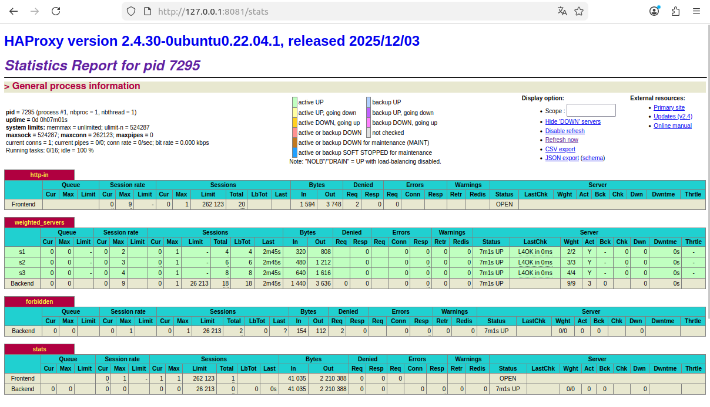

# Домашнее задание: Балансировка HAProxy + Nginx

**Студент:** Калинин Андрей


---

## Задание 1. Балансировка Round-robin на 4 уровне (TCP)

### Описание
Запущено два Python-сервера на портах 8888 и 9999.  
HAProxy настроен в режиме TCP (L4) с алгоритмом roundrobin и слушает порт 8080.

### Конфигурация HAProxy (задание 1)
```haproxy
global
    log /dev/log local0
    log /dev/log local1 notice
    chroot /var/lib/haproxy
    stats socket /run/haproxy/admin.sock mode 660 level admin expose-fd listeners
    stats timeout 30s
    user haproxy
    group haproxy
    daemon

defaults
    log global
    mode tcp
    option tcplog
    timeout connect 5000
    timeout client 50000
    timeout server 50000

listen web_balancer
    bind :8080
    mode tcp
    balance roundrobin
    server s1 127.0.0.1:8888 check
    server s2 127.0.0.1:9999 check

listen stats
    bind :8081
    mode http
    stats enable
    stats uri /stats
    stats refresh 5s
    stats auth admin:admin
```

Скриншот 1 


Скриншот 2


## Задание 2. Балансировка Weighted Round Robin на 7 уровне (HTTP) с фильтрацией по домену

### Описание
Запущено три Python-сервера на портах 8001, 8002, 8003.
HAProxy работает в режиме HTTP (L7) с весами:

сервер 1 – вес 2

сервер 2 – вес 3

сервер 3 – вес 4

Балансировка включается только для запросов с заголовком Host: example.local.
Остальные запросы получают ответ 403 Forbidden.

### Конфигурация HAProxy (задание 2)
```haproxy
global
    log /dev/log local0
    log /dev/log local1 notice
    chroot /var/lib/haproxy
    stats socket /run/haproxy/admin.sock mode 660 level admin expose-fd listeners
    stats timeout 30s
    user haproxy
    group haproxy
    daemon

defaults
    log global
    mode http
    option httplog
    timeout connect 5000
    timeout client 50000
    timeout server 50000

frontend http-in
    bind *:8080
    mode http
    acl is_example hdr(host) -i example.local
    use_backend weighted_servers if is_example
    default_backend forbidden

backend weighted_servers
    mode http
    balance roundrobin
    server s1 127.0.0.1:8001 weight 2 check
    server s2 127.0.0.1:8002 weight 3 check
    server s3 127.0.0.1:8003 weight 4 check

backend forbidden
    mode http
    http-request deny status 403

listen stats
    bind :8081
    mode http
    stats enable
    stats uri /stats
    stats refresh 5s
    stats auth admin:admin
```


Проверка работоспособности
Скриншот 1 



Скриншот 2 



Скриншот 3


